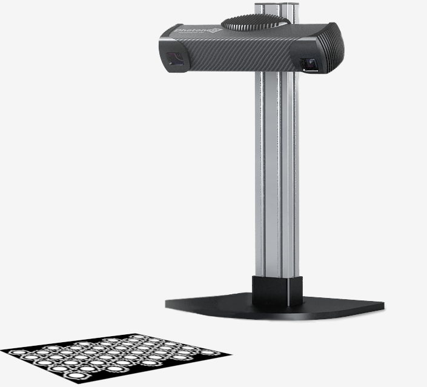
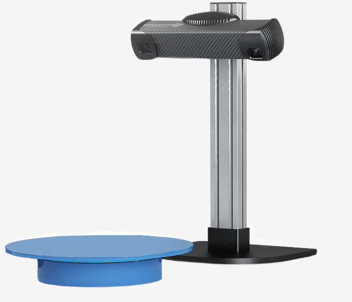

Introduction
------------

PhoXi 3D Meshing is a Windows-based application for automatic mesh creation from scans acquired by
Photoneo scanning devices. Providing both a graphical user interface and API environment, it is
able to perform scan acquisition, point cloud alignment and filtering, and surface reconstruction.
The whole mesh-creating pipeline can be carried out as a one-click solution or in a step-by-step
mode where each action is controlled by the user.

The application supports surface reconstruction on an automatic rotary table or in manual mode
using marker patterns. The application supports the use of multiple Photoneo 3D scanning devices
and allows the export of the reconstructed surface into PLY, STL, COGS, and FBX formats.

